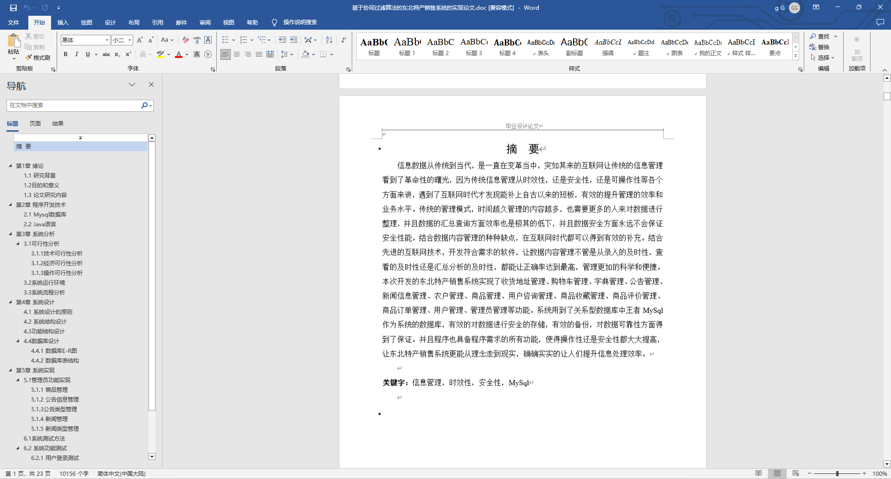
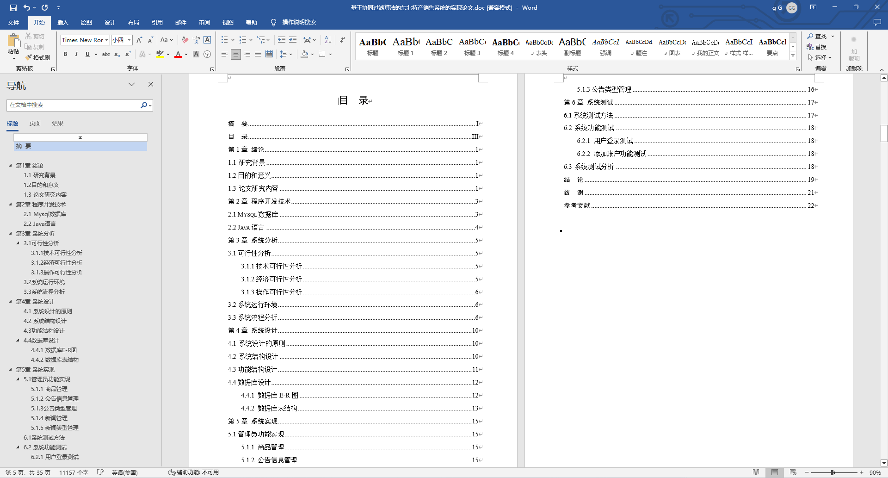
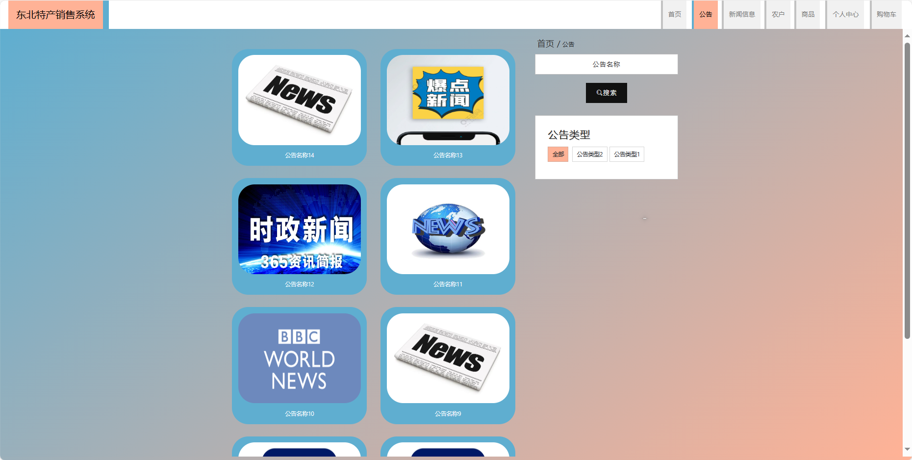
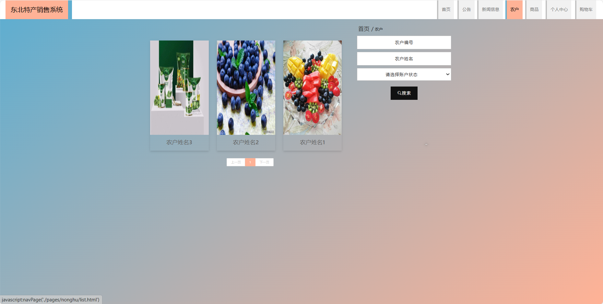
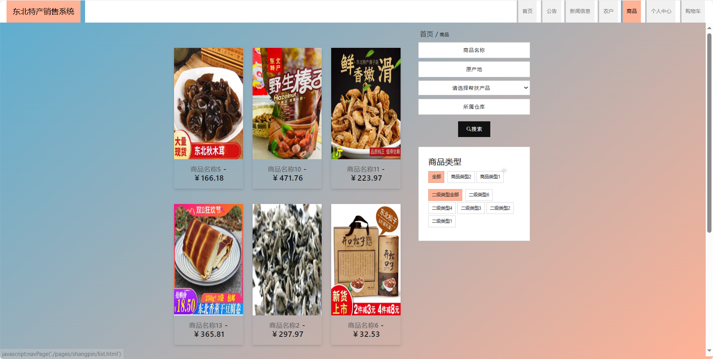
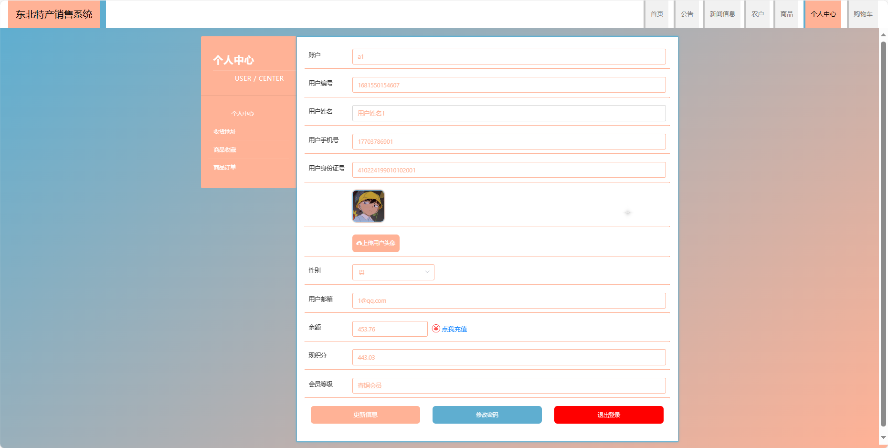

基于Springboot的东北特产销售系统（程序+论文）
=
### 完整代码获取地址：从戎源码网 ([https://armycodes.com/](https://armycodes.com/))
### 作者微信：19941326836  QQ：952045282 
### 承接计算机毕业设计、Java毕业设计、Python毕业设计、深度学习、机器学习
### 选题+开题报告+任务书+程序定制+安装调试+论文+答辩ppt 一条龙服务
### 所有选题地址https://github.com/nature924/allProject

一、项目介绍
---
基于Spring Boot框架实现的东北特产销售系统，系统包含三种角色：管理员、用户,农户主要功能如下。
### 【用户功能】

1. **首页：** 浏览东北特产销售系统的主要信息。
2. **公告：** 查看系统发布的重要通知和公告。
3. **新闻信息：** 阅读有关东北特产的最新新闻和信息。
4. **农户：** 浏览和搜索各个农户提供的特产信息。
5. **商品：** 浏览系统中各类特产商品。
6. **个人中心：** 管理个人信息，查看购物车中的商品。
7. **购物车：** 查看已选购的商品，进行结算和下单。

### 【管理员功能】

1. **首页：** 查看销售系统整体概况。
2. **个人中心：** 修改密码、管理个人信息。
3. **管理员管理：** 审核和管理注册管理员用户的信息。
4. **基础数据管理：** 管理系统的基础数据，包括公告类型、会员等级类型、新闻类型、商品类型和帮扶申请类型等。
5. **公告管理：** 发布、编辑和删除系统的通知和公告。
6. **新闻信息管理：** 发布、编辑和删除关于东北特产的新闻信息。
7. **商品管理：** 管理特产商品的信息，包括商品基本信息、评价、收藏、订单和帮扶申请等。
8. **用户咨询管理：** 查看和管理用户对特产商品的咨询信息。
9. **用户管理：** 审核和管理注册用户的信息。
10. **农户管理：** 管理注册的农户信息。
11. **轮播图信息：** 管理销售系统首页的轮播图。

### 【农户功能】

1. **首页：** 查看东北特产销售系统。
2. **个人中心：** 修改密码、管理个人信息。
3. **公告管理：** 发布、编辑和删除关于农户自身的公告信息。
4. **新闻信息管理：** 发布、编辑和删除关于农户自身的新闻信息。
5. **商品管理：** 管理农户提供的特产商品信息，包括商品基本信息、评价、订单和帮扶申请等。
6. **用户咨询管理：** 查看和管理用户对农户商品的咨询信息。

二、项目技术
---
- 编程语言：Java
- 数据库：MySQL
- 项目管理工具：Maven
- 前端技术：VUE、HTML、Jquery、Bootstrap
- 后端技术：Spring、SpringMVC、MyBatis

三、运行环境
---
- 操作系统：Windows、macOS都可以
- JDK版本：JDK1.8以上都可以
- 开发工具：IDEA、Ecplise、Myecplise都可以
- 数据库: MySQL5.7以上都可以
- Tomcat：任意版本都可以
- Maven：任意版本都可以

四、运行截图
---
### 论文截图：

### 程序截图：

